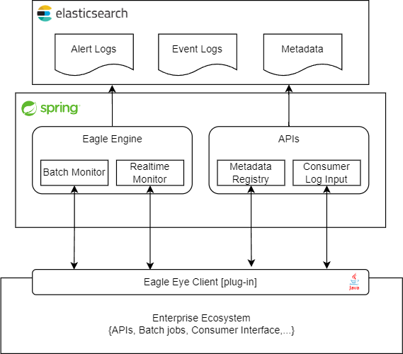

# The Eagle Eye Project

The Eagle Eye Project is a revolutionary open-source suite of tools, meticulously crafted to empower businesses with 
enhanced monitoring capabilities for their E2E transactions across diverse platforms. Designed to seamlessly integrate 
into your existing infrastructure, this cutting-edge project offers a wide array of tools, clients and exposed REST 
APIs, to accomplish the intent.

By deploying The Eagle Eye Project, you gain unprecedented insights into all transactions occurring within your various 
platforms, powered by Elasticsearch and Kibana. Its powerful visualization tools provide a comprehensive view of these 
transactions, enabling you to track their flow with precision. Moreover, the project goes beyond visualization, 
equipping you with essential performance metrics to ensure optimal operational efficiency.

One of the key strengths of The Eagle Eye Project lies in its proactive approach to identifying potential issues. With 
intelligent alert systems in place, the project can promptly notify you of any transaction failures well before they 
reach the critical end-of-life phase. This early warning capability enables you to take swift corrective action, 
preventing any significant disruptions and minimizing downtime. All the stakeholders could be notified at the sametime,
minimizing the back and forth between platform teams.

Whether you operate in a complex enterprise environment or a dynamic startup ecosystem, The Eagle Eye Project is a 
game-changer. Empower your teams with real-time data, facilitate smoother collaboration, and gain a competitive edge in 
today's fast-paced business landscape. Embrace the future of transaction monitoring and elevate your business to new 
heights with the unparalleled capabilities of The Eagle Eye Project.

## High Level Architecture

[//]: # (![High Level Design]&#40;ee-design.png&#41;)

    

